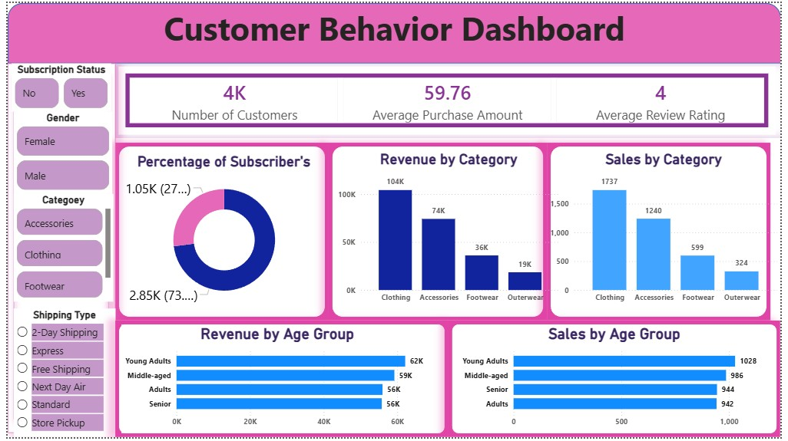

# 🛍️ Customer Shopping Behavior Analysis

**End-to-end data analysis project using Python, SQL, and Power BI to understand customer spending, subscriptions, discounts, and product performance.**

<h2 align="center">📊 Customer Behavior Dashboard</h2>

<p align="center">
  
</p>

---

## 📌 Project Overview & Objective

This project analyzes a retail customer shopping dataset of **3,900 transactions** to uncover how different customer groups buy, spend, and respond to discounts, shipping options, and subscriptions.

**Objective:** Turn raw customer data into clear, actionable business insights by cleaning the data (Python), answering business questions (SQL), and presenting the results in an interactive dashboard (Power BI).

---

## 📂 Dataset Information

| Item | Details |
|---|---|
| **File** | `customer_shopping_behavior.csv` |
| **Rows × Columns** | 3,900 × 18 |
| **Missing values** | 37 in `Review Rating` (all other columns complete) |

**Columns:** Customer ID, Age, Gender, Item Purchased, Category, Purchase Amount (USD), Location, Size, Color, Season, Review Rating, Subscription Status, Shipping Type, Discount Applied, Promo Code Used, Previous Purchases, Payment Method, Frequency of Purchases

**Dataset at a glance**

| Field | Values |
|---|---|
| Categories | Clothing, Accessories, Footwear, Outerwear |
| Gender | Male (2,652), Female (1,248) |
| Subscription | No (2,847), Yes (1,053) |
| Shipping types | Free Shipping, Standard, Store Pickup, Next Day Air, Express, 2-Day Shipping |
| Locations | 50 unique |
| Age range | 18 – 70 (mean ≈ 44) |
| Purchase amount | $20 – $100 (mean ≈ $59.76) |

---

## 🛠️ Tools & Technologies

| Tool | Purpose |
|---|---|
| **Python (Pandas)** | Data cleaning, feature engineering, export |
| **SQL (MySQL syntax)** | Business analysis queries |
| **Power BI** | Interactive dashboard & KPIs |
| **Excel (.xlsx)** | Cleaned dataset output |

---

## 🧹 Data Cleaning & Preparation

Performed in [`data_cleaning.py`](data_cleaning.py):

1. **Data inspection** – `head()`, `info()`, `describe()`, and `isnull().sum()`.
2. **Missing values** – Filled the 37 missing `Review Rating` values with the **median rating of each product category**.
3. **Column standardization** – Converted names to lowercase with underscores; renamed `purchase_amount_(usd)` to `purchase_amount`.
4. **Feature engineering**
   - `age_group` – customers split into 4 quartile-based groups (`Young Adults`, `Adults`, `Middle-aged`, `Senior`) using `pd.qcut`.
   - `purchase_frequency_days` – converted text frequency (e.g., Weekly, Monthly, Quarterly) into number of days.
5. **Redundancy check** – Compared `discount_applied` and `promo_code_used` and dropped `promo_code_used` as a duplicate column.
6. **Export** – Saved the cleaned data as `customer_shopping_behavior_cleaned.xlsx`.

---

## 🔍 EDA / Analysis

Exploratory analysis focused on:

- Revenue and order volume by **gender, category, and age group**
- **Subscriber vs. non-subscriber** spending behavior
- **Discount usage** by product
- **Customer loyalty** segmentation based on previous purchases
- Product popularity and review ratings

---

## 🗄️ SQL Analysis

All queries are in [`Business_Analysis_using_SQL_Queries.sql`](Business_Analysis_using_SQL_Queries.sql), run on the `customer_shopping` table (3,900 rows).

| # | Business Question | SQL Concepts Used |
|---|---|---|
| 1 | Total revenue by male vs. female customers | `SUM`, `GROUP BY` |
| 2 | Discount users who spent above the average purchase amount | Subquery, `WHERE` |
| 3 | Top 5 products by average review rating | `AVG`, `ORDER BY`, `LIMIT` |
| 4 | Average purchase: Standard vs. Express shipping | `ROUND`, `IN` |
| 5 | Do subscribers spend more? (average spend & total revenue) | `COUNT`, `AVG`, `SUM` |
| 6 | Top 5 products with the highest discount rate | `CASE WHEN`, percentage calculation |
| 7 | Segment customers into New / Returning / Loyal | CTE, `CASE WHEN` |
| 8 | Top 3 most purchased products in each category | CTE, `ROW_NUMBER() OVER (PARTITION BY …)` |
| 9 | Are repeat buyers (>5 previous purchases) likely to subscribe? | Filtering, `GROUP BY` |
| 10 | Revenue contribution of each age group | `SUM`, `ORDER BY` |

**Sample output (Q1 – Revenue by Gender)**

| Gender | Total Revenue |
|---|---|
| Male | $157,890 |
| Female | $75,191 |

---

## 📊 Power BI Dashboard

File: [`Customer_Behavior_Dashboard.pbix`](Customer_Behavior_Dashboard.pbix)

**Interactive filters (slicers):** Subscription Status, Gender, Category, Shipping Type

**Visuals**

| Visual | What it shows |
|---|---|
| KPI cards | Number of customers, average purchase amount, average review rating |
| Donut chart | Percentage of subscribers vs. non-subscribers |
| Bar charts | Revenue by category and sales (order count) by category |
| Bar charts | Revenue by age group and sales (order count) by age group |

---

## 📈 Key KPIs

| KPI | Value |
|---|---|
| Number of Customers | **3,900 (~4K)** |
| Average Purchase Amount | **$59.76** |
| Average Review Rating | **~3.75** (shown as 4 on the dashboard) |
| Total Revenue | **$233,081** (Male $157,890 + Female $75,191) |
| Subscribers | **1,053 (27%)** |
| Non-subscribers | **2,847 (73%)** |

---

## 💡 Key Insights

- **Clothing leads** in both revenue (**$104K**) and sales (**1,737**), followed by Accessories ($74K, 1,240 sales), Footwear ($36K, 599), and Outerwear ($19K, 324).
- **Male customers drive most revenue** – about **68%** of total revenue ($157,890 vs. $75,191), and they make up 68% of customers (2,652 of 3,900).
- **Only 27% of customers are subscribers**, leaving a large non-subscribed base (73%).
- **Young Adults generate the most revenue** (**$62K**, 1,028 sales), followed by Middle-aged ($59K), and Adults and Seniors (both $56K). Spending is fairly evenly spread across age groups.
- **Discounts are widely used** – 1,677 of 3,900 purchases (43%) had a discount applied.
- **Shipping preferences are evenly split** across all six shipping options (627–675 orders each).

---

## 🎯 Business Recommendations

*Based on the findings above:*

1. **Grow the subscriber base** – With only 27% subscribed, launch targeted campaigns to convert existing customers; use the SQL analysis (Q5, Q9) to track whether subscribers spend more and whether repeat buyers subscribe.
2. **Prioritize Clothing and Accessories** – These two categories bring in most revenue and orders, so focus inventory and marketing there.
3. **Boost Outerwear and Footwear** – The lowest-performing categories offer room for promotions or bundles.
4. **Engage female customers** – They contribute roughly a third of revenue, so tailored marketing could close the gap.
5. **Target Young Adults while retaining other groups** – They are the top revenue group, but the other age groups are close behind.
6. **Use discounts strategically** – With 43% of purchases discounted, review which products rely most on discounts (SQL Q6) to protect margins.

---

## 🔄 Project Workflow

```
Raw CSV Data
    ↓
Python (Pandas): Clean, transform, engineer features
    ↓
Cleaned Excel Dataset
    ↓
SQL: Business analysis (10 queries)
    ↓
Power BI: Interactive dashboard
    ↓
Insights & Recommendations
```

---

## 📁 Project Folder Structure

```
├── customer_shopping_behavior.csv              # Raw dataset
├── data_cleaning.py                            # Python data cleaning script
├── Business_Analysis_using_SQL_Queries.sql     # SQL business analysis queries
├── Customer_Behavior_Dashboard.pbix            # Power BI dashboard file
├── Customer_behavior_dashboard_Screenshot.jpg  # Dashboard preview
└── README.md
```

> `customer_shopping_behavior_cleaned.xlsx` is generated when you run `data_cleaning.py`.

---

## ▶️ How to Run the Project

**1. Clone the repository**
```bash
git clone <your-repository-url>
cd <repository-folder>
```

**2. Clean the data (Python)**
```bash
pip install pandas openpyxl
python data_cleaning.py
```
This creates `customer_shopping_behavior_cleaned.xlsx`.

**3. Run the SQL analysis**
- Load the cleaned data into a database table named `customer_shopping`.
- Open `Business_Analysis_using_SQL_Queries.sql` in your SQL client (MySQL syntax) and run the queries.

**4. View the dashboard**
- Open `Customer_Behavior_Dashboard.pbix` in **Power BI Desktop**.

---

## 🧰 Skills Demonstrated

| Area | Skills |
|---|---|
| **Python** | Pandas, data cleaning, missing-value imputation, feature engineering (`qcut`, mapping), file export |
| **SQL** | Aggregations, subqueries, CTEs, `CASE WHEN`, window functions (`ROW_NUMBER`) |
| **Power BI** | KPI cards, slicers, donut and bar charts, dashboard design |
| **Analytics** | Customer segmentation, revenue analysis, KPI tracking |
| **Business** | Turning data into insights and recommendations |

---

## ✅ Conclusion

This project shows a complete analytics workflow, from raw data to a business-ready dashboard. The analysis shows that revenue is concentrated in **Clothing and Accessories** and among **male customers**, that **most customers are not yet subscribers**, and that spending is fairly balanced across age groups. These findings point to clear opportunities in subscriptions, underperforming categories, and customer segment targeting.

---

## 👤 Author

SIKANDAR KHAN
Aspiring Data Analyst

🔗 [LinkedIn](https://www.linkedin.com/in/sikandar-khan-5ba465422/) | 💻 [GitHub](https://github.com/sikandar-data-analyst) | 📧 sikandarkhankhan980@gmail.com
